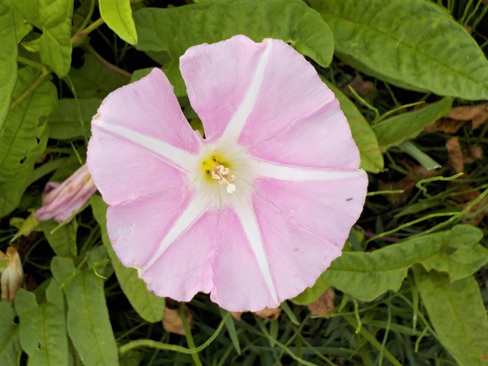
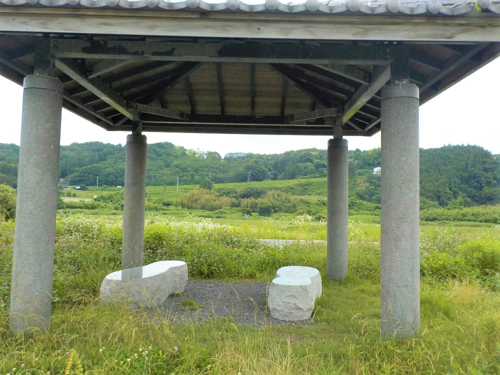
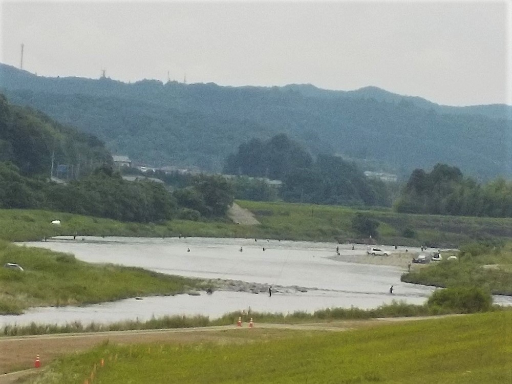

# mahoroba_2019
 <html lang="ja">
 <head>
 <meta charset="UTF-8">
 <title>まほろば_2017</title>

<link rel="stylesheet" href="../style.css/" type="text/css">
  
  
</head>

<body>

<h1><marquee behavior="alternate">!!! まほろばの湯 2019/08/09 !!!</marquee></h1>

<a href="https://torokoid.github.io/mahoroba/">Grand_Top</a>&gt;<a href="https://torokoid.github.io/mahoroba_home/">Home</a>&gt;mahoroba_2019

                           

<marquee direction="right" scrollamount="20" width="30%">(^_^)/~hada</marquee>

<h3>2019年の記録</h3>

<ul>
<li></li>
<li></li>
<li></li>
<li></li>
<li></li>
</ul>

<!--

 
-->
                           
<!-- <section>
 <a href="https://opa.cig2.imagegateway.net/s/cp/B8ahZttFFTL" target="_blank">鮎パ＠まほろば　2017/08/06、PassWD:なし</a>
       </section> -->

<!-- フッタ -->
 <footer>
 Copyright 2019/07/24 S.Hada
 </footer>
